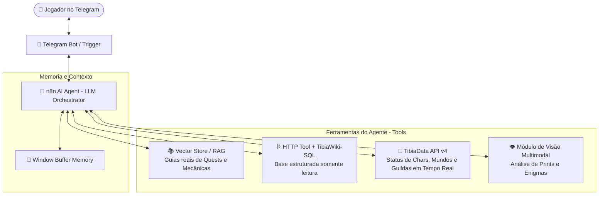

# 🗡️ GPTibia — Agente Inteligente de Suporte e Estratégia para Tibia

> **Disciplina:** Desenvolvimento de Agentes de IA (DAIA)  
> **Plataforma:** n8n + Telegram Bot + LangChain  
> **Integrantes:** Grupo de DAIA  

---

## 📌 1. Visão Geral do Projeto

O **GPTibia** é um agente inteligente autônomo projetado para atuar como o **oráculo e assistente em tempo real** de jogadores de Tibia. 

Durante o jogo, os jogadores precisam consultar constantemente dezenas de páginas da Wiki para checar fraquezas elementais de monstros, passos complexos de quests, localizações de NPCs, fórmulas de dano ou verificar se bosses e jogadores adversários estão ativos. 

O **GPTibia** resolve esse problema centralizando fontes verificáveis em uma interface conversacional via **Telegram**, combinando **inteligência generativa (LLMs)**, **recuperação de informação em documentos reais (RAG)**, **banco de dados estruturado da Wiki** e **APIs comunitárias em tempo real**.

---

## 🏗️ 2. Arquitetura do Agente

O projeto é orquestrado através do **n8n**, utilizando a arquitetura de **AI Agent (ReAct / LangChain)** com múltiplas ferramentas (*tools*) conectadas:



---

## ⚡ 3. Principais Funcionalidades e Integrações

### 📖 1. Base RAG de Quests e Mecânicas (em reconstrução)
* O catálogo inicial de PDFs foi retirado do pipeline porque parte dos arquivos referenciados não existia.
* A nova base utilizará apenas páginas ou documentos reais, verificáveis e com URL de origem.
* O RAG será usado para walkthroughs, lore, mecânicas de bosses e outros conteúdos narrativos que não existem no SQLite.

### 🗄️ 2. Integração com a Base TibiaWiki ([tibiawiki-sql](https://github.com/Galarzaa90/tibiawiki-sql))
* Snapshot SQLite gerado a partir da API comunitária da TibiaWiki e validado localmente.
* A view semântica `item_details` combina os campos básicos de `item` com ataque, defesa, armor, requisitos e resistências armazenados em `item_attribute`.
* Consulta a dados consolidados e estruturados:
  * **Itens e Equipamentos:** Atributos, peso, resistências, valores de venda em NPCs e fórmulas de imbuements.
  * **Bestiário Completo:** Pontos de vida, fraquezas elementais (Físico, Fogo, Gelo, Energia, Terra, Holy, Death), drops e taxas de loot.
  * **Spells e Runas:** Custo de mana, nível mínimo, vocações permitidas e dano estimado.

### 📡 3. Integração com a API em Tempo Real ([TibiaData API v4](https://tibiadata.com/))
* **Verificação de Personagens:** Consultar nível atual, vocação, mundo, mortes recentes e se o jogador está online no momento.
* **Status do Mundo:** Quantidade de jogadores online, horário do Server Save e status dos servidores.
* **Guildas e Casas:** Relação de membros e proprietários.

### 👁️ 4. Reconhecimento Visual de Prints (Multimodal)
* O jogador pode enviar um print do jogo no Telegram (ex: mensagem de puzzle em uma quest, drop de loot raro ou tela de morte).
* A LLM multimodal analisa a imagem e responde na hora com a solução do enigma ou o valor total do loot.

### 🔋 5. Servidor Autônomo e Conectividade Edge
* O fluxo pode ser executado de forma contínua e dedicada em um servidor físico portátil de baixo consumo, garantindo que o bot do Telegram responda 24 horas por dia sem custos recorrentes de hospedagem em nuvem.

---

## 📋 4. Alinhamento com as Atividades da Disciplina DAIA

| Etapa / Atividade | Descrição no Projeto GPTibia |
| :--- | :--- |
| **Atividade 11/08 (System Message)** | Definição da persona do GPTibia: tom prestativo e estratégico, especialista em mecânicas, respeitando o domínio do jogo e com limites claros. |
| **Atividade 18/08 (Casos de Teste CT01-CT07)** | Validação da comunicação: testes de consulta de fraqueza de bosses, rotas de quests, perguntas fora do domínio (recusa educada) e mensagens incompletas. |
| **Atividade 25/08 (Base Documental JSON)** | Catálogo inicial de 20 referências. A auditoria posterior identificou arquivos inexistentes; o catálogo foi mantido apenas como histórico e não será ingerido pelo RAG. |
| **Projeto Final (n8n Workflow)** | Implementação completa do fluxo no n8n com nós de Chat/Telegram, AI Agent, Embeddings, Vector Store e chamadas REST API. |

---

## 🛠️ 5. Tecnologias Utilizadas

* **Orquestração de Agentes:** [n8n](https://n8n.io/) (`@n8n/n8n-nodes-langchain`)
* **Modelos de Linguagem (LLM):** OpenAI GPT-4o-mini / Google Gemini 1.5 Flash
* **Interface do Usuário:** Telegram Bot API
* **Base Estruturada:** [tibiawiki-sql](https://github.com/Galarzaa90/tibiawiki-sql) 9.0.0 (SQLite)
* **Integração da Base:** API HTTP stateless autenticada; MCP SSE disponível como alternativa
* **API de Dados Dinâmicos:** [TibiaData API v4](https://docs.tibiadata.com/)
* **Formatos de Base:** SQLite para dados estruturados; HTML, Markdown ou PDF reais para RAG

### Execução local da base estruturada

```bash
./scripts/update_tibiawiki_db.sh
./scripts/start_tibiawiki_http_api.sh
./scripts/start_tibiawiki_http_tunnel.sh
```

Depois que o túnel exibir a URL HTTPS, gere o workflow local com as credenciais injetadas:

```bash
./scripts/configure_n8n_http_workflow.py --api-url https://SEU-TUNEL.trycloudflare.com
```

Importe `gptibia_telegram_workflow.local.json` no n8n. O arquivo contém um token e é ignorado pelo Git. Consulte [docs/ARQUITETURA_DADOS.md](docs/ARQUITETURA_DADOS.md) para os controles de segurança, as limitações do túnel e a alternativa MCP SSE.

---

## 💬 6. Exemplos de Interação com o GPTibia

```text
Usuário: Qual a fraqueza elemental do Demon e que set de Knight você recomenda pra caçar em Goroma?
GPTibia: O Demon possui fraqueza principal a dano de Gelo (Ice - 112%) e Sagrado (Holy - 112%), sendo imune a Fogo e resistente a Energia (80%) e Terra (80%).
Para Knight em Goroma, recomendo utilizar uma arma imbuída com Ice (Frost), Fire Protection no escudo/armadura (como Prismatic Armor ou Falcon Plate com Imbuement de Proteção a Fogo) para mitigar as Great Fireballs dos Demons, e Garlic Necklace caso haja muitos Fire Devils por perto.
```

```text
Usuário: O jogador "Bobeek" está online agora?
GPTibia: [Consulta a TibiaData API]
Sim! O personagem Bobeek (Elder Druid, Level 2400+) está online no momento no servidor Gentebra.
```
